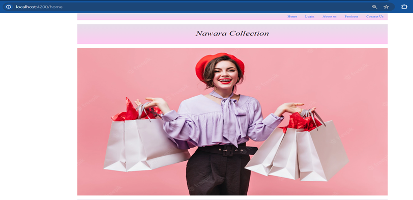
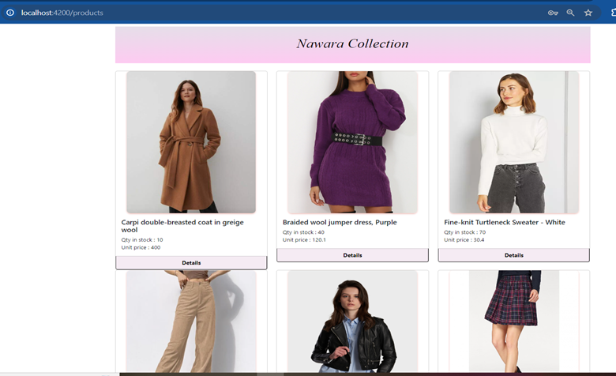
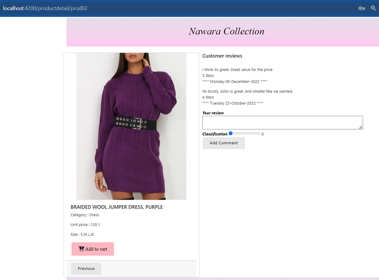
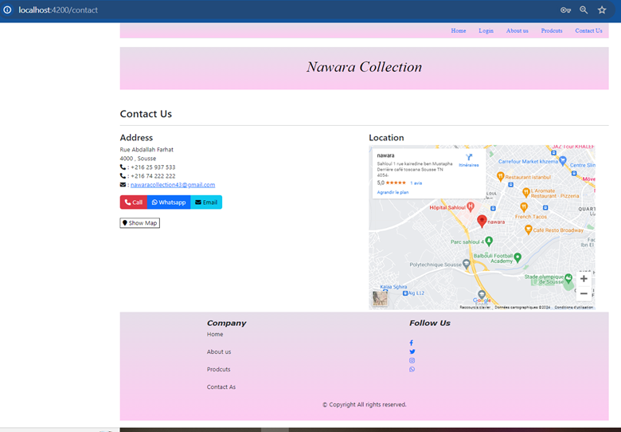
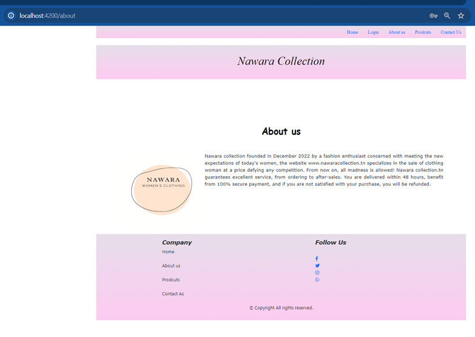

# Nawara-Collection - Site Web Statique pour une Plateforme E-Commerce

**Nawara Collection** est un site web statique e-commerce destiné à la vente de produits de mode pour femmes. Ce projet permet aux utilisateurs de découvrir les produits, d'ajouter des articles à leur panier et de consulter les détails des produits. Il est construit en utilisant **HTML5**, **CSS3**, **TypeScript**, et **AngularJS**.

## Fonctionnalités

- **Affichage des produits** : Liste des produits avec possibilité de filtrer et de trier.
- **Page produit** : Détails complets d'un produit avec description, taille, couleur, et prix.
- **Ajout au panier** : Permet à l'utilisateur d'ajouter des produits à son panier.
- **Page Contact Us** : Une page interactive avec une carte pour localiser la boutique.
- **Page About Us** : Présentation de la boutique et de ses produits, y compris une liste des articles disponibles.
- **Responsive design** : Le site est optimisé pour une utilisation sur mobile et bureau.

## Aperçu de l'application

### Écran d'accueil
  
*Description : Aperçu de la page d'accueil avec une présentation des produits.*

### Produits
  
*Description : Aperçu des produits disponibles sur le site.*


### Détail d'un produit
  
*Description : Détails complets d'un produit avec options pour ajouter au panier.*

### Page Contact Us
  
*Description : Page de contact avec une carte pour localiser la boutique.*

### Page About Us
  
*Description : Présentation de l'entreprise .*

---

## Technologies utilisées
- **HTML5**
- **CSS3**
- **TypeScript**
- **AngularJS**  
- **Responsive design**
- **Carte interactive (Google Maps )**

---

## Installation et exécution

1. Clonez ce dépôt :
   ```bash
   git clone https://github.com/raniasouissi/Nawara-Collection-Site-Web-Statique-pour-une-Plateforme-E-Commerce.git
